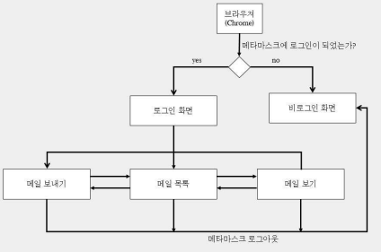
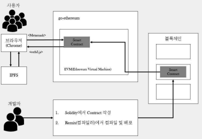
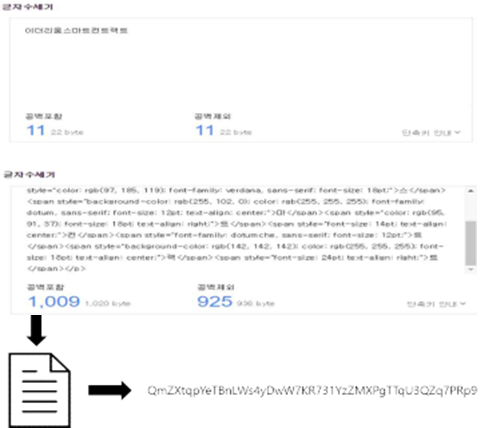

Ethereum Smart Contract를 이용한 E-Mail Dapp
=============

이메일 해킹에 따른 피해를 블록체인 기술로 보안 문제를 해결  
이메일 발송 시 html로 발송되어 크기가 커져 비용이 커지는 문제를  
ipfs를 이용하여 해시화된 내용을 보내어 비용을 줄일 수 있다.

# 개발 환경
| 분류 | 내용 |
| ------ | ------ |
| 운영체제 | Windows 10 Home |
| 개발언어 | Java Script, Solidity, Node.js |
| 디자인 | HTML, CSS |
| 개발도구 | MetaMask, Ethereum Smart Contract, [IPFS](https://ipfs.tech/) |

# 참여 인원
| 학과 | 이름 | 역할 |
| ------ | ------ | ------ |
| 컴퓨터 공학과 | 김창진 | IPFS 응용, 디자인 |
| 컴퓨터 공학과 | 김병호 | Smart Contract 작성, 서버 구축 |

# 동작 방식
## Front-End

## Back_End

## IPFS 사용 예제

